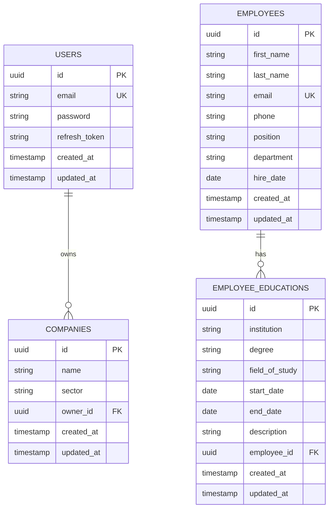

# Database Migrations Documentation

## Overview
This document describes the database migration system used in the Hoopy project. We use TypeORM migrations to manage database schema changes in a version-controlled, predictable way.

## Migration Files

### 1. Create Users Table (1710514000000)
Creates the base users table with authentication-related fields.

**Table: `users`**
- Primary Key: `id` (UUID, auto-generated)
- Fields:
  - `email` (varchar, unique, required)
  - `password` (varchar, required)
  - `refresh_token` (varchar, optional)
  - `created_at` (timestamp)
  - `updated_at` (timestamp)
- Indices:
  - Unique index on `email`

### 2. Create Companies Table (1710514500000)
Creates the companies table with a foreign key relationship to users.

**Table: `companies`**
- Primary Key: `id` (UUID, auto-generated)
- Fields:
  - `name` (varchar, required)
  - `sector` (varchar, required)
  - `owner_id` (UUID, required) - References users.id
  - `created_at` (timestamp)
  - `updated_at` (timestamp)
- Foreign Keys:
  - `fk_companies_owner`: owner_id → users.id (CASCADE on delete)

### 3. Create Employees Table (1710514700000)
Creates the employees table for storing employee information.

**Table: `employees`**
- Primary Key: `id` (UUID, auto-generated)
- Fields:
  - `first_name` (varchar, required)
  - `last_name` (varchar, required)
  - `email` (varchar, optional)
  - `phone` (varchar, optional)
  - `position` (varchar, optional)
  - `department` (varchar, optional)
  - `hire_date` (date, optional)
  - `created_at` (timestamp)
  - `updated_at` (timestamp)
- Indices:
  - Unique index on `email`

### 4. Create Employee Educations Table (1710514800000)
Creates the employee_educations table for storing employee education history.

**Table: `employee_educations`**
- Primary Key: `id` (UUID, auto-generated)
- Fields:
  - `institution` (varchar, required)
  - `degree` (varchar, required)
  - `field_of_study` (varchar, optional)
  - `start_date` (date, optional)
  - `end_date` (date, optional)
  - `description` (varchar, optional)
  - `employee_id` (UUID, required) - References employees.id
  - `created_at` (timestamp)
  - `updated_at` (timestamp)
- Foreign Keys:
  - `fk_employee_educations_employee`: employee_id → employees.id (CASCADE on delete)

## Migration Commands

### Available Commands
```bash
# Generate a new migration from entity changes
npm run migration:generate src/migrations/DescriptiveName

# Create a new empty migration
npm run migration:create src/migrations/DescriptiveName

# Run pending migrations
npm run migration:run

# Revert the last executed migration
npm run migration:revert
```

### Migration Workflow
1. Make changes to your entity files
2. Generate a new migration:
   ```bash
   npm run migration:generate src/migrations/DescriptiveNameOfChange
   ```
3. Review the generated migration file
4. Run the migration:
   ```bash
   npm run migration:run
   ```
5. If something goes wrong, revert:
   ```bash
   npm run migration:revert
   ```

## Configuration

The migration configuration is set in `src/infrastructure/database/typeorm/typeorm.config.ts`:

```typescript
{
  synchronize: false,        // Disabled to prevent auto-schema updates
  dropSchema: false,        // Disabled to prevent accidental data loss
  migrationsRun: true,      // Automatically run pending migrations on startup
  migrations: [join(__dirname, '../../../migrations/*{.ts,.js}')]
}
```

## Best Practices

1. **Never modify existing migrations** that have been committed to version control
2. **Always create new migrations** for schema changes
3. **Test migrations** both `up` and `down` methods before committing
4. **Keep migrations small** and focused on specific changes
5. **Use meaningful names** for migration files
6. **Include both forward and rollback changes** in each migration
7. **Document complex migrations** with comments

## Entity Relationships

